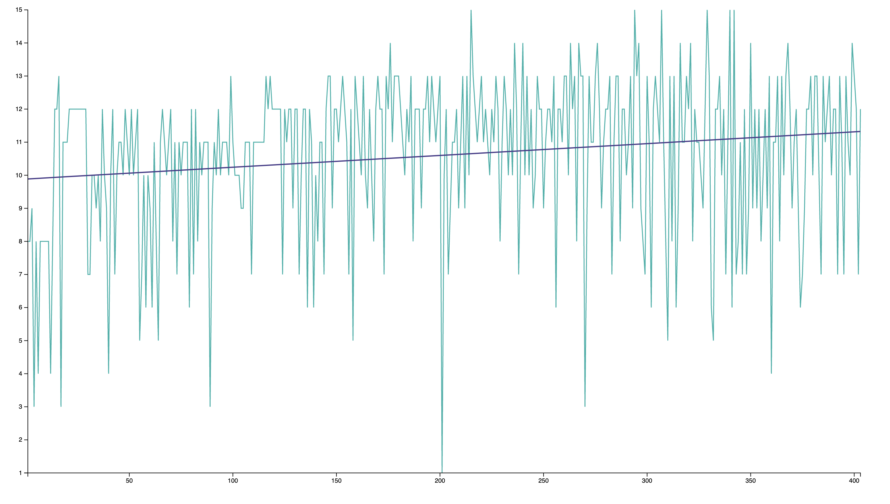

A simple line chart visualizing the number of colors Bob Ross has used in each episode of The Joy of Painting. Made using [d3.js](https://d3js.org/) as an exercise for the [Fullstack D3 Masterclass](https://www.newline.co/fullstack-d3). Data from [jwilber](https://github.com/jwilber/Bob_Ross_Paintings).

